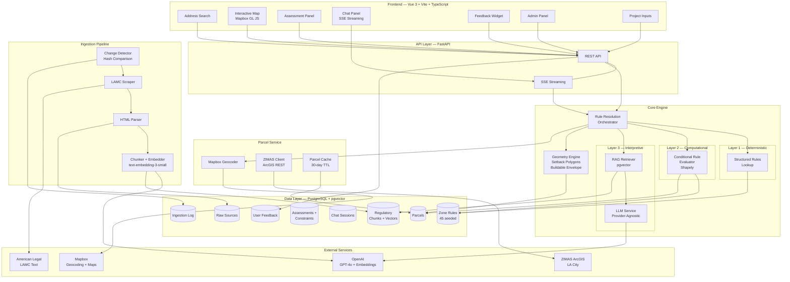
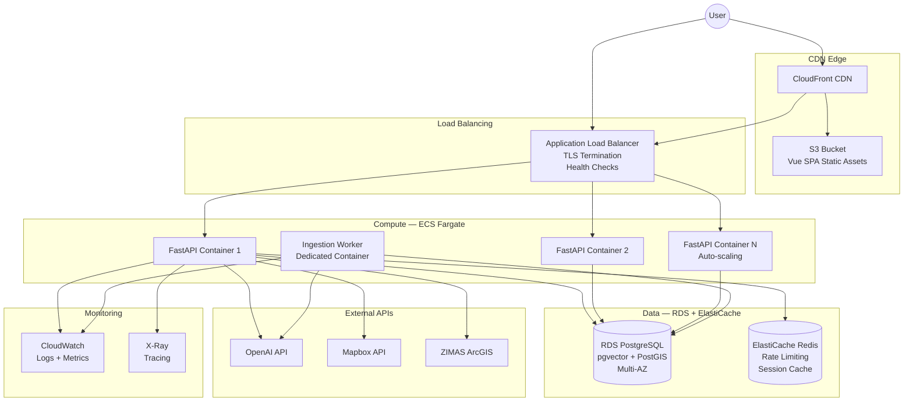
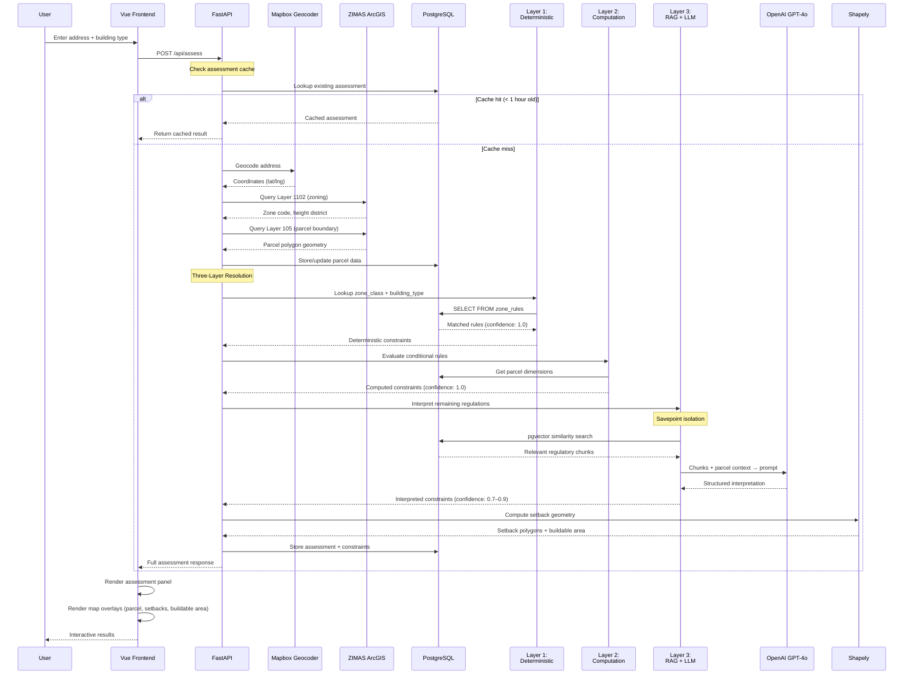
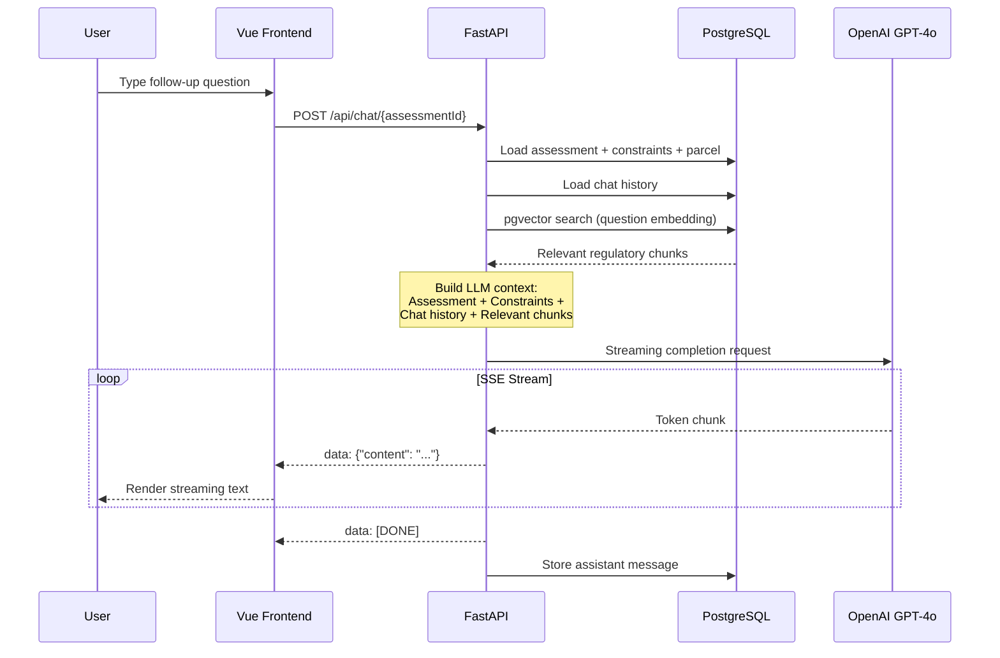
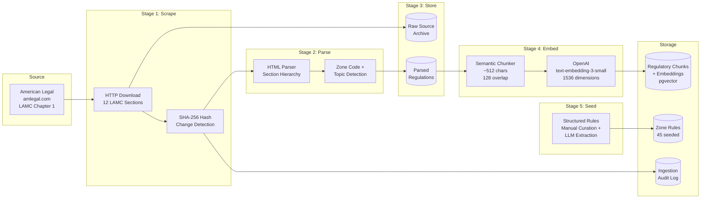

# Cover Regulatory Engine — Architecture

> Three diagrams showing the system from different perspectives: logical components, production deployment, and data flow.

---

## 1. Logical Architecture

How the system's components relate to each other.

---

## 2. Production Deployment (AWS)

How the system would be deployed at scale. The PoC runs locally via Docker Compose; this diagram shows the productionized version.

### Deployment Notes

| Component | Service | Sizing | Notes |
|-----------|---------|--------|-------|
| Frontend | S3 + CloudFront | N/A | Static SPA, globally cached |
| API | ECS Fargate | 0.5 vCPU / 1GB per task | Auto-scales 2–10 tasks |
| Ingestion | ECS Fargate | 1 vCPU / 2GB | Single long-running task |
| Database | RDS PostgreSQL 16 | db.r6g.large | pgvector + PostGIS extensions |
| Cache | ElastiCache Redis | cache.t3.micro | Rate limiting, session store |
| LLM | OpenAI API | N/A | Provider-agnostic interface allows swapping |

---

## 3. Data Flow — Assessment Request

What happens when a user enters an address and requests an assessment.

---

## 4. Data Flow — Chat Follow-Up

What happens when a user asks a follow-up question via the chat panel.

---

## 5. Ingestion Pipeline

How regulatory data is scraped, parsed, and stored for the RAG system.

### Three-Layer Storage

| Layer | What | Why | Reprocessable? |
|-------|------|-----|----------------|
| **Raw** | Original HTML from amlegal.com | Provenance, reproducibility | Source of truth |
| **Parsed** | Structured regulation records with section hierarchy | Human-readable, searchable | From raw layer |
| **Embedded** | Semantic chunks with 1536-dim vectors | RAG similarity search | From parsed layer |

Each layer is independently reprocessable — a change in the parser doesn't require re-scraping, and a change in the embedding model doesn't require re-parsing.
