# Cover Home Building Regulatory Engine — Project Plan

> Generated from PRD review on March 10, 2026

## 1. Product Overview

### Vision
A fullstack regulatory engine that takes a residential parcel (address or APN) in the City of Los Angeles and produces a structured, evidence-backed buildability assessment — what can be built, with what constraints, at what confidence level, and citing specific regulations. It replaces slow, manual regulatory research with real-time, traceable, explainable answers, accelerating design feasibility and reducing entitlement surprises.

### Target Users
Architects and Engineers with knowledge of zoning codes and regulations. They can validate the tool's claims, read maps, understand parcels, and interpret technical regulatory language.

### Key Outcomes
- Reduce regulatory research effort to near-zero
- Answer buildability questions in real-time as inputs change
- Consistent, cited regulatory answers across parcels
- Demonstrate a scalable architecture (LA City → LA County → California → beyond)

---

## 2. Requirements Summary

### Functional Requirements

| ID | Domain | Requirement | Priority |
|----|--------|-------------|----------|
| FR-01 | Input | Accept a residential address or APN to identify a parcel | Must-have |
| FR-02 | Assessment | Produce a structured buildability assessment with zoning & regulatory constraints | Must-have |
| FR-03 | Evidence | Include supporting evidence and citations for each constraint | Must-have |
| FR-04 | Confidence | Distinguish deterministic parcel data from interpretive/inferred conclusions with confidence signals | Must-have |
| FR-05 | Visualization | Basic visualization of the parcel and any existing buildings | Must-have |
| FR-06 | Coverage | Tested on a range of residential parcels and building types (SFH, ADU, Guest House, etc.) | Must-have |
| FR-07 | UX | Target user can interact with the interface and easily see outputs | Must-have |
| FR-08 | Documentation | Architecture diagram showing how this could be productionized | Must-have |
| BF-01 | Context | Output responsive to project inputs (bedrooms, bathrooms, sqft, stories) | Bonus |
| BF-02 | Feedback | Accept user feedback on bad responses to improve future answers | Bonus |
| BF-03 | Chat | Chat-like interface for follow-up questions about results and data (SSE streaming) | Bonus |
| BF-04 | Map | Interactive map translating regulations into visual annotations | Bonus |
| BF-05 | Geometry | Generate actionable geometry like setbacks from parcel + regulations | Bonus |
| BF-06 | Admin | Admin interface for the regulatory engine pipeline | Bonus |

### Non-Functional Requirements

| ID | Category | Requirement | Target |
|----|----------|-------------|--------|
| NFR-01 | Performance | Deterministic rule lookups | < 100ms |
| NFR-02 | Performance | Full assessment (including LLM) | < 10s |
| NFR-03 | Performance | Chat response streaming start | < 1s |
| NFR-04 | Reliability | Demo stability | Cached fallback for external APIs |
| NFR-05 | Scalability | Architecture supports multi-jurisdiction expansion | Documented in architecture diagram |
| NFR-06 | Traceability | Every constraint cites specific regulation sections | 100% citation coverage |
| NFR-07 | Deployability | Single command to run locally | `docker compose up` |

### Assumptions
- Geographic scope limited to City of Los Angeles residential parcels
- Both LAMC Chapter 1 (original) and Chapter 1A (new) are in effect; PoC focuses on Chapter 1 since it covers the majority of residential parcels
- ZIMAS ArcGIS REST API remains publicly accessible
- A focused subset of residential zones (R1, R2, RD1.5, RE9/RE11/RE15/RE20/RE40) is sufficient for the PoC
- OpenAI API access is available with a valid API key
- Mapbox API access is available with a valid API key (free tier)

### Open Questions
- Specific test parcels/addresses to be provided by Cover
- Whether Chapter 1A coverage is expected for any community plan areas
- Preferred building types to prioritize beyond SFH, ADU, Guest House

---

## 3. Architecture

### System Overview

```mermaid
graph TB
    subgraph "Frontend — Vue 3 + Vite + TypeScript"
        UI[Address/APN Input]
        MAP[Mapbox Map View]
        ASSESS[Assessment Panel]
        CHAT[Chat Interface]
        FEEDBACK[Feedback Widget]
        ADMIN[Admin Panel]
    end

    subgraph "API Layer — FastAPI"
        REST[REST API + SSE Streaming]
    end

    subgraph "Core Engine — Hybrid Rule Resolution"
        PARCEL_SVC[Parcel Service]
        RESOLVER[Rule Resolution Orchestrator]

        subgraph "Layer 1: Deterministic"
            RULES_DB[Structured Rules Lookup]
        end

        subgraph "Layer 2: Computational"
            COMPUTE[Computation Engine — Shapely]
        end

        subgraph "Layer 3: Interpretive"
            RAG[RAG Retrieval — pgvector]
            LLM_SVC[LLM Service — Provider Agnostic]
        end

        GEOM[Geometry Engine — Setbacks]
    end

    subgraph "Data Layer — Postgres + pgvector + PostGIS"
        ZONE_RULES[(Structured Zone Rules)]
        PARCELS_DB[(Parcels Cache)]
        REG_DB[(Parsed Regulations)]
        CHUNKS_DB[(Regulatory Chunks + Embeddings)]
        RAW_DB[(Raw Source Archive)]
        FEEDBACK_DB[(User Feedback)]
        CHAT_DB[(Chat Sessions)]
        LOG_DB[(Ingestion Audit Log)]
    end

    subgraph "Ingestion Pipeline"
        SCRAPER[LAMC Scraper]
        PARSER[HTML Parser + Structurer]
        EXTRACTOR[Rule Extractor — LLM-assisted]
        CHUNKER[Chunker + Embedder]
        CHANGE_DET[Change Detection Scheduler]
    end

    subgraph "External Services"
        ZIMAS[ZIMAS ArcGIS REST API]
        GEOCODE[Mapbox Geocoding API]
        AMLEGAL[American Legal — LAMC]
        OPENAI[OpenAI API]
    end

    UI --> REST
    MAP --> REST
    CHAT --> REST
    FEEDBACK --> REST
    ADMIN --> REST

    REST --> RESOLVER
    REST --> FEEDBACK_DB
    REST --> CHAT_DB

    RESOLVER --> PARCEL_SVC
    RESOLVER --> RULES_DB
    RESOLVER --> COMPUTE
    RESOLVER --> RAG
    RESOLVER --> LLM_SVC
    RESOLVER --> GEOM

    RULES_DB --> ZONE_RULES
    COMPUTE --> ZONE_RULES
    COMPUTE --> PARCELS_DB
    RAG --> CHUNKS_DB
    LLM_SVC --> OPENAI
    GEOM --> PARCELS_DB

    PARCEL_SVC --> PARCELS_DB
    PARCEL_SVC --> ZIMAS
    PARCEL_SVC --> GEOCODE

    SCRAPER --> RAW_DB
    SCRAPER --> AMLEGAL
    PARSER --> REG_DB
    EXTRACTOR --> ZONE_RULES
    EXTRACTOR --> OPENAI
    CHUNKER --> CHUNKS_DB
    CHANGE_DET --> SCRAPER
    CHANGE_DET --> LOG_DB
```



### Hybrid Rule Resolution — Three-Layer Architecture

The core innovation is a three-layer reasoning engine that uses the right tool for each type of regulatory question:

**Layer 1 — Deterministic Lookup:** Direct database query for known zone parameters (setbacks, height, FAR). Returns structured values with confidence 1.0 and exact LAMC citations. No LLM involved — instant and always correct.

**Layer 2 — Conditional Computation:** Evaluates rules with conditions against parcel dimensions. Example: side setback = 5ft, or 10% of lot width if lot < 50ft wide, minimum 3ft. Uses Python/Shapely for computation. Confidence 1.0.

**Layer 3 — RAG + LLM Interpretation:** For ambiguous regulations, overlay zone interactions, specific plans, or edge cases not covered by structured rules. Retrieves relevant regulatory chunks via pgvector semantic search, sends to LLM with parcel context. Confidence 0.5-0.9, clearly marked as "interpreted."

This hybrid approach ensures deterministic answers are always correct (critical for architect trust), while still handling genuinely ambiguous regulations.

### Component Breakdown

#### Ingestion Pipeline
| Component | Responsibility | Technology |
|-----------|---------------|------------|
| LAMC Scraper | Download zoning code HTML from amlegal.com | `httpx` + `BeautifulSoup` |
| HTML Parser | Extract regulatory text, preserve section hierarchy (Chapter > Article > Section) | Custom section-aware parser |
| Rule Extractor | LLM-assisted extraction of structured parameters from parsed text, with human review | OpenAI structured output + manual curation |
| Chunker/Embedder | Split remaining text into semantic chunks (~512 chars, 128 overlap), embed | OpenAI `text-embedding-3-small` |
| Change Detector | Periodic hash comparison of source documents, trigger re-ingestion on delta | `APScheduler` |

Three-layer storage: Raw HTML archived for provenance → Parsed into structured records → Embedded chunks for RAG fallback. Each layer is independently reprocessable.

#### Parcel Service
| Component | Responsibility | Technology |
|-----------|---------------|------------|
| Geocoder | Address → coordinates | Mapbox Geocoding API |
| ZIMAS Client | Query ArcGIS REST layers (zoning layer 1102, parcel geometry, building outlines) | `httpx` + custom client |
| Parcel Cache | Store parcel data with 30-day TTL | Postgres + PostGIS |

#### Core Engine
| Component | Responsibility | Technology |
|-----------|---------------|------------|
| Rule Resolution Orchestrator | Coordinates three-layer resolution, merges results, handles conflicts | Python service class |
| Structured Rules Lookup | Queries ZoneRule table by zone_class + building_type + parameter | SQLAlchemy |
| Computation Engine | Evaluates conditional rules against parcel dimensions | Python + Shapely |
| RAG Retriever | Hybrid search: metadata filter (zone_code, topic) + pgvector semantic similarity | pgvector + SQL |
| LLM Service | Provider-agnostic interface for regulation interpretation | Abstract class → OpenAI implementation |
| Geometry Engine | Computes setback polygons, buildable envelope from parcel geometry + resolved rules | Shapely + PostGIS |

#### API Layer
| Component | Responsibility | Technology |
|-----------|---------------|------------|
| REST API | Assessment, parcels, feedback, admin endpoints | FastAPI |
| SSE Streaming | Streaming chat responses via `StreamingResponse` | FastAPI + `text/event-stream` |

#### Frontend
| Component | Responsibility | Technology |
|-----------|---------------|------------|
| Address Search | Input with Mapbox geocoding autocomplete | Vue 3 component |
| Map View | Parcel visualization, setbacks, regulatory overlays | Mapbox GL JS |
| Assessment Panel | Structured constraints grouped by category, citations, confidence badges | Vue 3 components |
| Chat Panel | Follow-up questions with SSE streaming responses | Vue 3 + `fetch` readable stream |
| Feedback Widget | Thumbs up/down + optional comment per constraint | Vue 3 component |
| Admin Panel | Pipeline status, rules browser, feedback review, trigger re-ingestion | Vue 3 (separate route) |

### Data Models

```python
# === Ingestion Layer ===

class RawSource:
    id: UUID
    source_url: str
    content_hash: str          # SHA-256 for change detection
    raw_content: str           # Full HTML/PDF text
    content_type: str          # "html" | "pdf"
    fetched_at: datetime
    superseded_by: UUID | None # Links to newer version

class ParsedRegulation:
    id: UUID
    raw_source_id: UUID        # FK → RawSource
    section_number: str        # e.g., "12.08"
    section_title: str         # e.g., "R1 ONE-FAMILY ZONE"
    article: str               # e.g., "Article 2"
    chapter: str               # e.g., "Chapter 1"
    zone_codes: list[str]      # e.g., ["R1", "R1V", "R1F"]
    topic: str                 # e.g., "setbacks", "height", "use", "density"
    body_text: str             # Clean extracted text
    effective_date: date | None
    parsed_at: datetime

class RegulatoryChunk:
    id: UUID
    regulation_id: UUID        # FK → ParsedRegulation
    chunk_index: int           # Order within the regulation
    chunk_text: str            # ~512 char semantic chunk
    embedding: Vector(1536)    # text-embedding-3-small
    zone_codes: list[str]      # Denormalized for filtering
    topic: str                 # Denormalized for filtering
    section_number: str        # Denormalized for citation

# === Structured Rules Layer ===

class ZoneRule:
    id: UUID
    zone_class: str            # "R1", "R2", "RD1.5", "RE11"
    parameter: str             # "front_setback", "max_height", "max_far"
    category: str              # "setback", "height", "density", "use", "far", "parking"
    base_value: float          # 20.0
    unit: str                  # "ft", "ratio", "stories", "sqft"
    conditions: dict | None    # Conditional logic (see below)
    applies_to: list[str]      # ["SFH", "ADU", "Guest House"] or ["ALL"]
    section_number: str        # "12.08" — for citation
    source_text: str           # Original regulation text
    regulation_id: UUID        # FK → ParsedRegulation
    is_verified: bool          # Human-reviewed flag
    notes: str | None          # Edge cases, reviewer notes

# Conditions schema:
# {
#   "when": {"lot_width_lt": 50},
#   "then": {"formula": "lot_width * 0.10", "min": 3.0},
#   "else": {"value": 5.0}
# }

# === Parcel Layer ===

class Parcel:
    id: UUID
    apn: str                   # Assessor Parcel Number
    address: str | None
    zone_code: str             # e.g., "R1-1"
    zone_class: str            # e.g., "R1"
    height_district: str       # e.g., "1"
    specific_plan: str | None
    overlay_zones: list[str]
    lot_area_sqft: float
    lot_width_ft: float | None
    lot_depth_ft: float | None
    geometry: Geometry         # PostGIS polygon
    building_footprints: list[Geometry]
    centroid: Point            # PostGIS point
    community_plan_area: str | None
    cached_at: datetime
    cache_ttl_days: int        # Default 30

# === Assessment Layer ===

class Assessment:
    id: UUID
    parcel_id: UUID            # FK → Parcel
    building_type: str         # "SFH" | "ADU" | "Guest House"
    project_inputs: dict | None # bedrooms, bathrooms, sqft, stories
    constraints: list[Constraint]
    overall_confidence: float  # 0.0 - 1.0
    summary: str               # Human-readable summary
    created_at: datetime

class Constraint:
    id: UUID
    assessment_id: UUID        # FK → Assessment
    category: str              # "setback", "height", "far", "use", "density", "parking"
    parameter: str             # "front_setback", "max_height", etc.
    rule_text: str             # Human-readable constraint description
    value: str | None          # "20 ft", "0.45", "2 stories"
    numeric_value: float | None
    unit: str | None
    confidence: float          # 1.0 for Layer 1&2, variable for Layer 3
    source_layer: str          # "deterministic_lookup" | "computed" | "llm_interpreted"
    determination_type: str    # "deterministic" | "interpreted" | "inferred"
    citations: list[Citation]
    reasoning: str             # How derived
    geometry: Geometry | None  # Setback line, buildable area polygon
    zone_rule_id: UUID | None  # FK → ZoneRule (if from Layer 1 or 2)

class Citation:
    regulation_id: UUID        # FK → ParsedRegulation
    section_number: str
    section_title: str
    relevant_text: str         # The specific passage
    source_url: str

# === Interaction Layer ===

class ChatSession:
    id: UUID
    assessment_id: UUID        # FK → Assessment
    messages: list[ChatMessage]
    created_at: datetime

class ChatMessage:
    id: UUID
    session_id: UUID           # FK → ChatSession
    role: str                  # "user" | "assistant"
    content: str
    citations: list[Citation] | None
    created_at: datetime

class UserFeedback:
    id: UUID
    constraint_id: UUID | None # FK → Constraint
    assessment_id: UUID        # FK → Assessment
    rating: str                # "positive" | "negative"
    comment: str | None
    created_at: datetime

# === Audit Layer ===

class IngestionLog:
    id: UUID
    raw_source_id: UUID
    action: str                # "initial_ingest" | "change_detected" | "re_ingested" | "no_change"
    previous_hash: str | None
    new_hash: str
    chunks_created: int
    started_at: datetime
    completed_at: datetime
```

### API Surface

| Method | Endpoint | Description |
|--------|----------|-------------|
| POST | `/api/assess` | Submit address/APN + building type + optional project inputs → assessment |
| GET | `/api/assess/{id}` | Retrieve a previous assessment |
| GET | `/api/parcel/{apn}` | Get cached parcel data + geometry |
| GET | `/api/parcel/search?address=...` | Geocode address → parcel lookup |
| POST | `/api/chat/{assessment_id}` | Send follow-up question, returns SSE stream |
| GET | `/api/chat/{assessment_id}/history` | Get chat history for an assessment |
| POST | `/api/feedback` | Submit user feedback on a constraint/assessment |
| GET | `/api/admin/pipeline/status` | Ingestion pipeline status |
| GET | `/api/admin/pipeline/logs` | Ingestion audit logs |
| POST | `/api/admin/pipeline/trigger` | Manually trigger re-ingestion |
| GET | `/api/admin/regulations` | Browse parsed regulations |
| GET | `/api/admin/rules` | Browse structured zone rules |
| PUT | `/api/admin/rules/{id}` | Edit/verify a structured rule |
| GET | `/api/admin/stats` | System stats (parcels cached, chunks indexed, etc.) |

### Tech Stack

| Layer | Technology | Rationale |
|-------|-----------|-----------|
| Frontend | Vue 3 + Vite + TypeScript | Matches Cover's stack (Vue), modern tooling, type safety |
| UI Styling | Tailwind CSS | Fast iteration, custom aesthetic, utility-first |
| Map | Mapbox GL JS | Best GIS overlay support, parcel/setback rendering, industry standard |
| Backend | Python + FastAPI | PRD requirement (Python), matches Cover's stack (FastAPI), async support |
| Database | Postgres + pgvector + PostGIS | Single DB for relational + vector + spatial, matches Cover's stack |
| Cache | Redis (production only) | Session/rate limiting at scale; not needed for PoC |
| LLM | OpenAI GPT-4o (behind provider-agnostic interface) | Best structured output, mature ecosystem; swappable via abstraction |
| Embeddings | OpenAI text-embedding-3-small | Low cost ($0.02/1M tokens), good quality, 1536 dimensions |
| Geometry | Shapely | Python standard for computational geometry |
| Containerization | Docker + Docker Compose | Single-command local setup, matches Cover's stack |
| Cloud (production) | AWS (ECS Fargate, RDS, S3, CloudFront) | PRD preference, matches Cover's stack |

### Detected Stack Constraints
Greenfield project — no existing codebase constraints. Tech decisions aligned with Cover's known stack: Python, TypeScript/JavaScript, Vue, FastAPI, Postgres, Redis, AWS, Docker, RAG Systems, Vector Databases, LLM APIs.

### Shared Interfaces

| Interface | Location | Purpose | Depended on by |
|-----------|----------|---------|----------------|
| `LLMService` | `backend/services/llm/base.py` | Provider-agnostic LLM calls | Rule Resolver Layer 3, Chat, Rule Extractor |
| `RuleResolver` | `backend/services/engine/resolver.py` | Orchestrates 3-layer resolution | Assessment endpoint, Chat |
| `StructuredRuleLookup` | `backend/services/engine/rules.py` | Queries ZoneRule table | RuleResolver Layer 1 |
| `ComputationEngine` | `backend/services/engine/compute.py` | Evaluates conditional rules | RuleResolver Layer 2 |
| `RegulatoryRetriever` | `backend/services/engine/retriever.py` | RAG retrieval from pgvector | RuleResolver Layer 3, Chat, Admin |
| `ParcelData` | `backend/models/schemas.py` | Standardized parcel Pydantic model | All layers, Map, Geometry |
| `Constraint` | `backend/models/schemas.py` | Individual regulatory constraint | Assessment, Chat, Feedback, Geometry |
| `Citation` | `backend/models/schemas.py` | Regulatory source reference | All layers, Chat |
| `ZIMASClient` | `backend/services/parcel/zimas.py` | ZIMAS API abstraction | Parcel Service |
| `GeometryEngine` | `backend/services/engine/geometry.py` | Setback/buildable area computation | RuleResolver, Map overlays |

---

## 4. Strategy

### Build vs. Buy

| Capability | Decision | Rationale |
|-----------|----------|-----------|
| Geocoding | Buy (Mapbox API) | Free tier sufficient, same provider as map |
| Parcel/Zoning data | Public API (ZIMAS) | Free, authoritative government source |
| Regulatory text | Ingest from public source (amlegal.com) | Free, authoritative |
| Vector search | Build on pgvector | Aligns with stack, avoids vendor lock-in, single DB |
| LLM inference | Buy (OpenAI API) | Core competency is the pipeline, not the model |
| Map rendering | Buy (Mapbox GL JS) | Free tier, best quality for GIS overlays |
| Geometry computation | Build with Shapely | Open-source, full control |
| Streaming | Build with SSE | Simpler than WebSocket for server-to-client streaming |
| Auth | Build (simple API key) | PoC scope; production would use OAuth |

### MVP Scope
**In MVP (must-haves):** Address/APN input, structured buildability assessment with citations and confidence, parcel map visualization, tested on representative parcels, architecture diagram.

**Bonus features (all targeted):** Project inputs (BF-01), feedback collection (BF-02), chat with streaming (BF-03), interactive regulatory map (BF-04), setback geometry (BF-05), admin panel (BF-06).

**Explicitly deferred:** Multi-jurisdiction support (architecture supports it, not built), user authentication/accounts, real-time collaborative editing, PDF export of assessments, Chapter 1A (new zoning code) coverage.

### Iteration Approach
- Feedback mechanism (BF-02) feeds into the admin panel (BF-06) for human review
- Negative feedback on deterministic constraints → admin corrects ZoneRule entry → all future assessments fixed
- Negative feedback on interpreted constraints → stored as context, optionally included in future LLM prompts as correction signal
- Aggregate feedback stats identify regulations most frequently disputed → prioritizes converting interpreted rules into verified structured rules
- Change detection scheduler ensures regulatory data stays current (monthly LAMC checks, weekly parcel cache TTL)

### Deployment Strategy
**Local development:** Docker Compose with hot-reload (FastAPI + Vite dev servers)

**Production (documented in architecture diagram, not built for PoC):**
```
┌──────────────────────────────────────────────┐
│  CloudFront CDN                              │
│  └── S3: Vue 3 SPA static assets            │
└──────────────┬───────────────────────────────┘
               │
┌──────────────▼───────────────────────────────┐
│  ALB (Application Load Balancer)             │
└──────────────┬───────────────────────────────┘
               │
┌──────────────▼───────────────────────────────┐
│  ECS Fargate                                 │
│  ├── FastAPI Service (2+ containers)         │
│  └── Ingestion Worker (1 container)          │
└──────────────┬───────────────────────────────┘
               │
┌──────────────▼───────────────────────────────┐
│  RDS Postgres (pgvector + PostGIS)           │
│  └── ElastiCache Redis (rate limiting)       │
└──────────────────────────────────────────────┘
```

---

## 5. Project Structure

```
cover-regulatory-engine/
├── backend/
│   ├── alembic/                    # Database migrations
│   │   └── versions/
│   ├── app/
│   │   ├── api/
│   │   │   ├── routes/
│   │   │   │   ├── assess.py       # Assessment endpoints
│   │   │   │   ├── parcel.py       # Parcel lookup endpoints
│   │   │   │   ├── chat.py         # Chat + SSE streaming
│   │   │   │   ├── feedback.py     # User feedback endpoints
│   │   │   │   └── admin.py        # Admin panel endpoints
│   │   │   └── deps.py             # Dependency injection
│   │   ├── models/
│   │   │   ├── database.py         # SQLAlchemy models
│   │   │   └── schemas.py          # Pydantic models (shared interfaces)
│   │   ├── services/
│   │   │   ├── llm/
│   │   │   │   ├── base.py         # LLMService abstract interface
│   │   │   │   └── openai.py       # OpenAI implementation
│   │   │   ├── engine/
│   │   │   │   ├── resolver.py     # Rule Resolution Orchestrator
│   │   │   │   ├── rules.py        # Layer 1: Structured rules lookup
│   │   │   │   ├── compute.py      # Layer 2: Computation engine
│   │   │   │   ├── retriever.py    # Layer 3: RAG retriever
│   │   │   │   └── geometry.py     # Setback/buildable area computation
│   │   │   ├── parcel/
│   │   │   │   ├── zimas.py        # ZIMAS ArcGIS REST client
│   │   │   │   ├── geocoder.py     # Mapbox geocoding
│   │   │   │   └── service.py      # Parcel service (cache + lookup)
│   │   │   └── ingestion/
│   │   │       ├── scraper.py      # LAMC HTML scraper
│   │   │       ├── parser.py       # HTML → structured regulations
│   │   │       ├── extractor.py    # LLM-assisted rule extraction
│   │   │       ├── embedder.py     # Chunker + embedder
│   │   │       └── scheduler.py    # Change detection scheduler
│   │   ├── core/
│   │   │   ├── config.py           # Settings + environment variables
│   │   │   └── database.py         # Database connection + session
│   │   └── main.py                 # FastAPI app entry point
│   ├── data/
│   │   └── seed/                   # Seed data for zone rules
│   ├── tests/
│   ├── Dockerfile
│   └── requirements.txt
├── frontend/
│   ├── src/
│   │   ├── components/
│   │   │   ├── AddressSearch.vue   # Geocoding autocomplete input
│   │   │   ├── MapView.vue         # Mapbox map with parcel overlays
│   │   │   ├── AssessmentPanel.vue # Constraint display with citations
│   │   │   ├── ConstraintCard.vue  # Individual constraint with confidence badge
│   │   │   ├── ChatPanel.vue       # Chat interface with SSE streaming
│   │   │   ├── FeedbackWidget.vue  # Thumbs up/down per constraint
│   │   │   ├── ProjectInputs.vue   # Building type, bedrooms, etc.
│   │   │   └── admin/
│   │   │       ├── PipelineStatus.vue
│   │   │       ├── RulesBrowser.vue
│   │   │       ├── FeedbackReview.vue
│   │   │       └── RegulationBrowser.vue
│   │   ├── views/
│   │   │   ├── HomeView.vue        # Main assessment view
│   │   │   └── AdminView.vue       # Admin panel
│   │   ├── services/
│   │   │   └── api.ts              # API client
│   │   ├── types/
│   │   │   └── index.ts            # TypeScript interfaces
│   │   ├── router/
│   │   │   └── index.ts            # Vue Router
│   │   ├── App.vue
│   │   └── main.ts
│   ├── Dockerfile
│   ├── package.json
│   ├── tailwind.config.js
│   ├── tsconfig.json
│   └── vite.config.ts
├── docker-compose.yml
├── .env.example                    # Required environment variables
├── PROJECT_PLAN.md
└── README.md
```

---

## 6. Implementation Plan

### Timeline
- **Start date:** March 10, 2026
- **Target completion:** March 17, 2026
- **Total estimated duration:** 7 days (full-time)

### Phase 1: Foundation + Ingestion Pipeline — Day 1 (March 10)

**Goal:** Project scaffolded, database running, regulatory data ingested and embedded.

**Deliverables:**
- [x] Monorepo scaffolding: `backend/` + `frontend/` directories
- [x] Docker Compose: Postgres with pgvector + PostGIS, FastAPI dev server
- [x] SQLAlchemy models + Alembic migrations for all data models
- [x] Shared Pydantic models (ParcelData, Constraint, Citation, Assessment)
- [x] LLMService abstract interface + OpenAI implementation
- [x] LAMC scraper: download zoning code HTML from amlegal.com
- [x] HTML parser: extract regulatory text with section hierarchy
- [x] Chunker + embedder: semantic chunks → text-embedding-3-small → pgvector
- [x] Structured zone rules: seed R1, R2, RD1.5, RE zones with core parameters
- [x] Change detection: hash-based comparison + ingestion audit log

**Key Tasks:**
1. Initialize project with Docker Compose (Postgres pgvector/postgis image)
2. Define SQLAlchemy models and run initial migration
3. Build Pydantic schemas for all shared interfaces
4. Implement LLMService base class + OpenAI provider
5. Write LAMC scraper targeting amlegal.com Chapter 1 zoning sections
6. Parse HTML into ParsedRegulation records preserving section hierarchy
7. Chunk parsed text and generate embeddings, store in pgvector
8. Curate ZoneRule seed data for R1, R2, RD, RE zones (setbacks, height, FAR, density, use)
9. Implement content hash storage and comparison for change detection

**Success Criteria:**
- Database populated with parsed regulations and embedded chunks
- `SELECT * FROM zone_rules WHERE zone_class = 'R1'` returns correct values
- Semantic search query returns relevant regulatory text

**Risks:**
- amlegal.com HTML may be hard to parse. **Mitigation:** Fall back to manual curation with LLM assistance for the focused zone subset.

---

### Phase 2: Core Engine + API — Day 2 (March 11)

**Goal:** Enter an address, get a structured buildability assessment from the API.

**Deliverables:**
- [ ] ZIMAS ArcGIS REST client: query parcel geometry, zoning, lot dimensions
- [ ] Mapbox geocoding integration (address → coordinates)
- [ ] Parcel service: geocode → ZIMAS lookup → Postgres/PostGIS cache
- [ ] Rule Resolution Orchestrator with three layers:
  - Layer 1: Structured rules lookup by zone_class + building_type
  - Layer 2: Computation engine for conditional rules
  - Layer 3: RAG retrieval + LLM interpretation for uncovered regulations
- [ ] Geometry engine: setback polygons from parcel geometry + resolved rules
- [ ] FastAPI endpoints: POST /api/assess, GET /api/assess/{id}, GET /api/parcel/search
- [ ] Assessment caching (lookup before recompute)

**Key Tasks:**
1. Build ZIMAS client with layer queries (1102 for zoning, parcel geometry, building outlines)
2. Integrate Mapbox geocoding API
3. Implement parcel service with PostGIS storage and TTL-based caching
4. Build Layer 1: query ZoneRule table, return constraints with confidence 1.0
5. Build Layer 2: conditional rule evaluator using parcel dimensions
6. Build Layer 3: pgvector hybrid search (metadata filter + semantic similarity) → LLM synthesis
7. Implement rule resolution orchestrator that merges all three layers
8. Build Shapely-based geometry engine for setback polygon computation
9. Wire up FastAPI routes with proper request/response schemas

**Success Criteria:**
- `curl -X POST /api/assess -d '{"address": "...", "building_type": "SFH"}'` returns structured JSON with constraints, confidence levels, citations, and GeoJSON setbacks

**Risks:**
- ZIMAS API may have undocumented quirks or rate limits. **Mitigation:** Pre-cache 10-15 representative parcels during development.

---

### Phase 3: Frontend Core — Day 3 (March 12)

**Goal:** Working UI — enter an address, see the full assessment with map. All must-haves complete.

**Deliverables:**
- [ ] Vue 3 + Vite + TypeScript project with Tailwind CSS
- [ ] Address search bar with Mapbox geocoding autocomplete
- [ ] Mapbox GL JS map: parcel polygon, existing buildings, zone boundaries
- [ ] Assessment panel: constraints grouped by category (setbacks, height, FAR, use, density, parking)
- [ ] Each constraint: value, confidence badge, determination type, expandable citations
- [ ] Setback lines and buildable area overlay on map
- [ ] Responsive layout: map + assessment side-by-side (desktop), stacked (mobile)
- [ ] Full API integration

**Key Tasks:**
1. Scaffold Vue 3 + Vite + TypeScript project with Tailwind
2. Set up Vue Router (home + admin routes)
3. Build API client service (typed fetch wrapper)
4. Implement AddressSearch component with Mapbox geocoder widget
5. Implement MapView component with Mapbox GL JS, parcel/building layers
6. Implement AssessmentPanel with ConstraintCard subcomponents
7. Add confidence badges and determination type indicators
8. Render setback geometry as map overlays with distance labels
9. Responsive CSS layout

**Success Criteria:**
- Architect can enter an LA residential address, see parcel on map, read structured assessment with citations and confidence. **All PRD must-haves (FR-01 through FR-07) functional.**

**This is the fallback point.** Everything after this is bonus.

---

### Phase 4: Bonus — Project Inputs + Chat — Day 4 (March 13)

**Goal:** Assessment responds to project context. Conversational follow-up with streaming.

**Deliverables:**
- [ ] **BF-01:** Project inputs panel — building type selector (SFH, ADU, Guest House), bedrooms, bathrooms, sqft, stories. Assessment updates dynamically.
- [ ] **BF-03:** Chat panel — SSE streaming responses. Follow-up questions about assessment. LLM receives assessment context + regulatory chunks + parcel data.
- [ ] Chat history persistence per assessment
- [ ] Smooth streaming text rendering

**Key Tasks:**
1. Build ProjectInputs component with form fields
2. Update assessment API to accept and use project_inputs parameter
3. Update rule resolver to filter/adjust rules by building type and project params
4. Build chat API endpoint with SSE StreamingResponse
5. Build ChatPanel component with message list + input
6. Implement SSE client using fetch readable stream
7. Persist chat sessions in database

**Success Criteria:**
- Changing building type to ADU produces ADU-specific constraints
- Chat follow-up "Can I build a two-story ADU?" returns a cited, streamed response

---

### Phase 5: Bonus — Feedback + Map + Geometry — Day 5 (March 14)

**Goal:** User feedback collection, rich map annotations, precise setback geometry.

**Deliverables:**
- [ ] **BF-02:** Feedback widget — thumbs up/down per constraint + optional comment, stored in DB
- [ ] **BF-04:** Interactive regulatory map — zone boundaries as colored overlays, click-to-inspect zone rules, setback lines with distance labels, buildable area polygon, height annotations
- [ ] **BF-05:** Actionable geometry — precise setback polygons from parcel + rules, buildable envelope, visual diff between parcel boundary and buildable area, exportable GeoJSON
- [ ] Map interactions: hover tooltips, click-to-inspect, legend

**Key Tasks:**
1. Build FeedbackWidget component with thumbs + comment form
2. Build feedback API endpoint
3. Add zone boundary overlay layer to map from ZIMAS data
4. Implement click-to-inspect: click zone area → show key rules popup
5. Add distance labels to setback lines on map
6. Compute and render buildable envelope polygon
7. Add visual legend for map layers
8. Implement GeoJSON export endpoint

**Success Criteria:**
- Map shows parcel with colored setback zones and distance labels
- User can click constraints to give feedback
- Buildable area is visually clear on the map

---

### Phase 6: Bonus — Admin Panel + Polish — Day 6 (March 15)

**Goal:** Admin interface demonstrates the full pipeline. UI is polished and professional.

**Deliverables:**
- [ ] **BF-06:** Admin panel at `/admin`:
  - Pipeline status dashboard (last ingestion, chunk count, rule count)
  - Ingestion audit log viewer
  - Parsed regulations browser with search
  - Structured rules table: browse, filter by zone, view/edit values, mark verified
  - User feedback review: filter by rating, link to originating assessment
  - Manual re-ingestion trigger
- [ ] UI polish: loading states, error states, empty states, transitions
- [ ] Edge case handling: invalid addresses, parcels outside LA, API errors
- [ ] Responsive design verification

**Key Tasks:**
1. Build admin route with tabbed navigation
2. Build PipelineStatus component with stats dashboard
3. Build RegulationBrowser with search and section tree
4. Build RulesBrowser with editable table and verification toggle
5. Build FeedbackReview with filtering and assessment links
6. Add re-ingestion trigger button with confirmation
7. Polish all loading/error/empty states across the app
8. Handle edge cases and error boundaries

**Success Criteria:**
- Admin can see pipeline state, browse regulations, manage rules, review feedback
- App handles invalid inputs gracefully with helpful messages

---

### Phase 7: Testing + Documentation — Day 7 (March 16-17)

**Goal:** Verified, documented, submission-ready.

**Deliverables:**
- [ ] Test on range of residential parcels:
  - R1 zone: Single Family Home
  - R1 zone: ADU
  - R2 zone: Two-family dwelling
  - RD zone: Small lot development
  - RE zone: Large lot estate
  - Various: Guest House
- [ ] Verify deterministic constraint values against known LAMC rules
- [ ] Architecture diagram: Mermaid logical diagram + AWS deployment diagram + data flow diagram
- [ ] README: setup instructions, environment variables, design decisions, architecture overview
- [ ] Bug fixes from testing
- [ ] Final review pass

**Success Criteria:**
- `docker compose up` starts the full application
- All test parcels produce reasonable, cited assessments
- Architecture diagram is clear and actionable
- README enables a reviewer to run the project in under 5 minutes

---

### Bonus Feature Priority (if behind schedule)

Drop from bottom first:

1. **BF-01 — Project inputs** (highest impact, modest effort)
2. **BF-03 — Chat interface** (impressive, demonstrates LLM depth)
3. **BF-05 — Setback geometry** (visually powerful, natural engine extension)
4. **BF-02 — Feedback widget** (simple build, shows product thinking)
5. **BF-04 — Interactive map annotations** (polish on existing map)
6. **BF-06 — Admin panel** (most effort, least user-facing — but shows engineering maturity)

Any bonus feature not completed in code will include a detailed implementation plan in the README.

---

## 7. Cost Analysis

### Development Costs

| Item | Cost | Notes |
|------|------|-------|
| OpenAI — Embedding ingestion | ~$0.01 | ~500K tokens @ $0.02/1M |
| OpenAI — Rule extraction | ~$0.75 | ~50 LLM calls for structured extraction |
| OpenAI — Dev/testing | ~$5.00 | ~200 assessment runs during development |
| Mapbox | $0.00 | Free tier |
| ZIMAS API | $0.00 | Public government API |
| Docker / Postgres | $0.00 | Runs locally |
| **Total** | **~$6** | |

### Operational Costs at Scale

*Assumptions: 5 assessments per user session, 2 chat messages per assessment, 1 map load per session.*

| Component | 100 users/mo | 1K users/mo | 10K users/mo | 100K users/mo |
|-----------|-------------|-------------|--------------|---------------|
| Compute (ECS Fargate) | $10 | $25 | $80 | $300 |
| Database (RDS Postgres) | $15 | $30 | $60 | $200 |
| Storage (S3 + DB) | $5 | $8 | $15 | $50 |
| CDN (CloudFront) | $2 | $5 | $12 | $40 |
| OpenAI API | $17 | $165 | $1,650 | $16,500 |
| Mapbox | $0 | $0 | $0 | $375 |
| Redis (ElastiCache) | — | — | $25 | $50 |
| Monitoring | $5 | $10 | $25 | $75 |
| **Monthly Total** | **~$54** | **~$243** | **~$1,867** | **~$17,590** |

*OpenAI API dominates costs at scale (90%+ above 10K users).*

### Alternative Cost Comparison

#### LLM Provider
| Provider | Monthly @ 1K users | Monthly @ 100K users | Notes |
|----------|--------------------|--------------------|-------|
| **OpenAI GPT-4o (chosen)** | $165 | $16,500 | Best structured output |
| Anthropic Claude 3.5 Sonnet | $135 | $13,500 | Strong document analysis |
| Google Gemini 1.5 Pro | $90 | $9,000 | Cheapest managed option |
| Self-hosted Llama 3 | ~$25 + GPU | ~$500 + GPU | Cheapest at scale, infra overhead |

#### Database
| Option | Monthly @ 1K users | Monthly @ 100K users | Notes |
|--------|--------------------|--------------------|-------|
| **RDS Postgres + pgvector (chosen)** | $30 | $200 | Single DB, simplest ops |
| RDS Postgres + Pinecone | $100 | $450 | Adds vendor dependency |
| RDS Postgres + Qdrant | $55 | $300 | Better vector perf, extra service |

#### Map Provider
| Option | Monthly @ 1K users | Monthly @ 100K users | Notes |
|--------|--------------------|--------------------|-------|
| **Mapbox (chosen)** | $0 | $375 | Best quality, generous free tier |
| MapLibre + free tiles | $0 | $0 | Free forever, lower quality |
| Google Maps | $0 | $1,400 | $200/mo credit, then expensive |

### Cost Optimization Strategies

| Strategy | Impact | Effort |
|----------|--------|--------|
| Assessment caching (in architecture) | -30-50% LLM costs | Already planned |
| Hybrid 3-layer resolution (in architecture) | -40-60% LLM costs | Already planned |
| Switch to Gemini for simple queries | -45% LLM costs | Config change |
| Batch API for ingestion | -50% embedding costs | Low |
| Self-host open-source LLM | -70% LLM costs | High |

### Cost Summary

| Category | Low Estimate | High Estimate |
|----------|-------------|---------------|
| Total development | $5 | $10 |
| Monthly ops @ 1K users | $200 | $300 |
| Monthly ops @ 10K users | $1,500 | $2,500 |
| Annual ops @ 10K users | $18,000 | $30,000 |

---

## 8. Risks & Mitigations

| Risk | Impact | Likelihood | Mitigation |
|------|--------|-----------|------------|
| amlegal.com HTML structure difficult to parse | High | Medium | Fall back to manual curation for focused zone subset; LLM assists extraction |
| ZIMAS API unreliable or rate-limited | High | Medium | Pre-cache representative parcels; cache-first architecture with TTL |
| LLM produces incorrect deterministic values | High | Medium | Hybrid architecture: Layer 1+2 handle deterministic rules without LLM |
| OpenAI API downtime during demo | Medium | Low | Assessment caching returns previous results; deterministic layers work offline |
| Scope creep on bonus features | Medium | Medium | Clear daily milestones with fallback point at Day 3; priority-ordered bonus list |
| Regulatory data more complex than expected | Medium | Medium | Focus on well-understood residential zones (R1, R2, RD, RE); explicitly scope to subset |
| 1-week timeline insufficient for all bonus features | Medium | Medium | Unfinished features get detailed implementation plan in README |

---

## 9. Next Steps

1. **Begin Phase 1 immediately** — scaffold project, set up Docker Compose, start data ingestion
2. **Obtain API keys** — OpenAI API key, Mapbox API key (free tier)
3. **Identify test parcels** — select 10-15 representative LA residential addresses across R1, R2, RD, RE zones
4. **Start building** — follow the 7-day implementation plan
